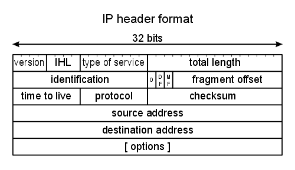

# The network layer

- application layer - http, smtp, snmp, etc.
- transport layer - tcp / udp
- ip layer (internet protocol)
- ethernet

## ip layer

- main network layer
- very robust
- data link layer emits or doesn't admit stuff into network - like traffic lights or stop signals
- link layer below ip layer
  - happens at every box / router
- ip protocol = internet protocol
  - happens at every box / router
  - needs to be very fast and small, yet robust and scalable
- hop-by-hop - happens at every stop (internet and link layers)

### packet headers



- help layers perform their tasks
- source address, destination address show from who and to who
- time to live - kill packets after 30 hops or so in network - to get rid of evil packets
- protocol - transport protocol (above)
- checksum - somewhat redundant, but shows the information integrity
- total length - length of packet in total
- type of service (tos) - in what type of user are you - are you gold class, silver, bronze, etc. in your isp plan. now net neutrality killed it. still used with live streaming etc.
- ISP - internet service provider, or AS. the internet is essentially a bunch of clouds. there are a few border / edge routers going to the outer internet, and a bunch of internal routers in the cloud.
- edge routers vs. core routers
- Tier "3" network is at the edge
- Tier "2" = above the edge
- Tier "1" = I-95 fast highway, on the top
- exterior Gateway Protocol - BGP (eBGP)
- interior gateway protocol (iBGP) - interior routes, isp's do whatever they want
- at the borders they have to use the exterior protocol
- `127.0.0.1` = me, `255.255.255.255` = everyone
- all other ips: *Net.Subnet.SubSubnet.Host*
- ip address: DHCP process that assign unique ip addresses
- firewall - process running in a subnet that masks ip addresses
- we're also running out of ip addresses
- one home has one ip address, acts as a firewall - all are `192.168.0.1` or something like that. this increases security because people outside cannot as easily target an individual device
- ipv4 header has lots of different stuff, but ipv6 header has less stuff with much larger source and destination addresses
- ipv6 has many more address space
- in 30 hops you can hit anything on the internet

```bash
traceroute # command for viewing network routes
traceroute google.com
```
